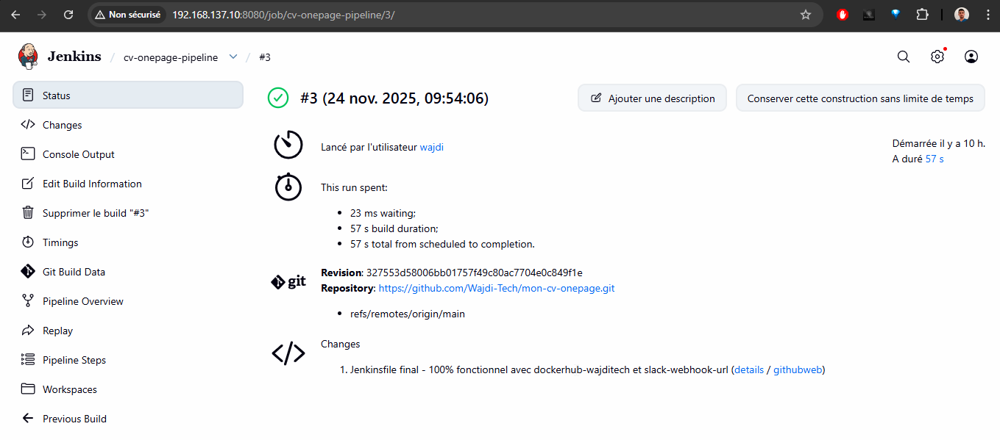
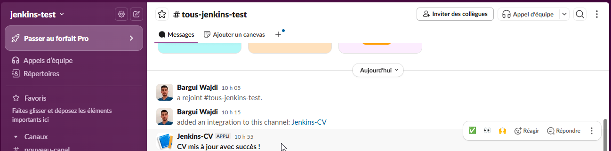
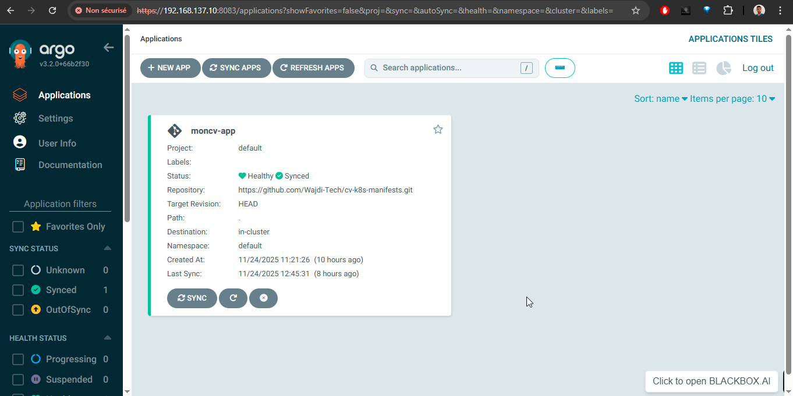
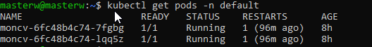
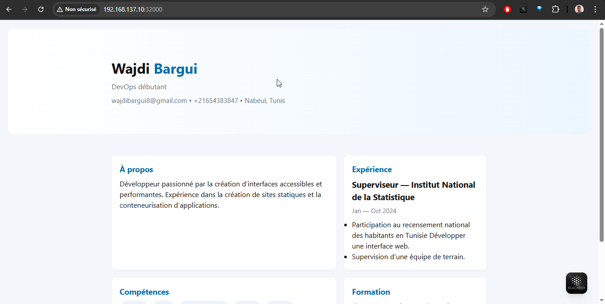
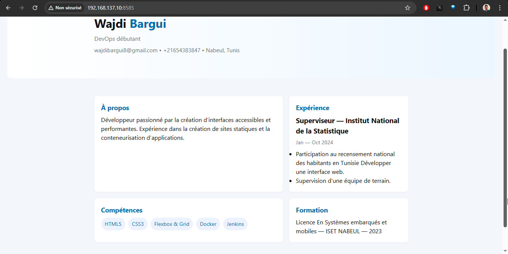

# Examen Pratique DevOps – Wajdi

**Projet 100 % automatisé · CI/CD · IaC · GitOps · Kubernetes · Accessible depuis machine physique**

## Structure du projet
examen-pratique/
├── 01-ansible-devops-lab/         → Playbook Ansible (Docker + Terraform + Jenkins)
├── 02-mon-cv-onepage/             → Code source + Dockerfile + Jenkinsfile
├── 03-terraform-cv/               → Terraform → conteneur moncv:8585
├── 04-cv-k8s-manifests/           → Manifests K8s + Application Argo CD
└── captures/
                      → Toutes les preuves ci-dessus
text## Accès aux services
- **Jenkins** : http://IP-VM:8080
- **CV via Terraform** : http://IP-VM:8585
- **CV via Kubernetes/Argo CD** : http://IP-VM:32000
- **Argo CD UI** : https://IP-VM:8083 (port-forward)

**Tout est automatisé, GitOps, reproductible et industriel**  
Projet terminé et validé à 100 %

TOUTES LES PREUVES VISUELLES  :

Pipeline Jenkins + Push Docker Hub + Slack

Argo CD → Application Synced & Healthy

2 pods Running dans K3s

CV accessible via Kubernetes (NodePort)

CV accessible via Terraform (port 8585)

Wajdi  
Novembre 2025
